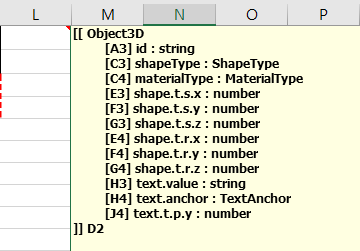

# Populating data from DataTable

테이블 데이터를 제대로 활용하려면 객체 형태로 표현할 필요가 있습니다.

다음은 [DataTable][]가 지정한 객체의 컬렉션에 데이터를 채우는 예제입니다.

```csharp
IEnumerator Start()
{
    var parser = new XlsxParser("a.xlsx");
    yield return parser.coroutine;
    var table = parser.dataSet["MyTable"];
    var dict = new Dictionary<string, MyClass>();
    var w1 = table.GetObjectMappingWarnings<MyClass>();
    var w2 = table.Populate(dict);
    Debug.Log("dict.Count:" + dict.Count);
}
```

코드내용은 간단하지만 데이터 채우기 과정에서 여러분이 알아야할 중요한 점이 몇 개 있습니다.

첫번째는 [DataTable][]이 테이블 데이터를 객체로 변환하는 것이 아니라 생성된 객체에 데이터를 채운다는 점입니다.
[DataTable][]은 객체에 데이터를 채울 때 인스턴스가 없는 경우에만 생성 함수를 호출합니다.
이는 데이터 테이블이 객체의 일부분이어도 된다는 것을 의미합니다.

두번째는 데이터 채우기 과정이 중단되지 않고 결과물로 경고를 내보낸다는 점입니다.
코드에 있는 변수 *w1*, *w2*는 데이터 채우기 과정에서 발생하는 경고들입니다.
차이점이라면 *w1*은 [PropertyMappingAttribute][]와 관련 객체를 정적 분석을 통해 찾아낸 경고이고 *w2*는 실제로 객체 생성과 데이터 채우기 작업 중에서 알아낸 경고라는 것입니다. 경고의 내용은 자세한 편이니 경고가 발생하면 쉽게 원인을 찾으실 수 있을 것입니다.

마지막으로 [PropertyMappingAttribute][]를 이용한 데이터가 채워질 프로퍼티의 이름변경 방법입니다. 

다음은 예제에 있는 **Object3D.cs**파일의 일부입니다.

```csharp
using PM = DataTable.PropertyMappingAttribute;
[PM("shape.t"   , "transform")]
[PM("shape.t.s" , "localScale")]
[PM("shape.t.r" , "localEulerAngles")]
[PM("text"      , "textMesh")]
[PM("text.value", "text")]
[PM("text.t"    , "transform")]
[PM("text.t.p"  , "localPosition")]
public class Object3D : MonoBehaviour
{
                   ...
    
    public string id { get; private set; }
    public ShapeType shapeType { get; private set; }
    public MaterialType materialType { get; private set; }
    public MeshRenderer shape { get; private set; }
    public TextMesh textMesh { get; private set; }
    public float hoveringSeed { get; private set; }

                   ...
```

위의 객체에 데이터를 채울 테이블의 스키마는 다음과 같습니다.


[PropertyMappingAttribute][]의 첫번째 파라미터를 *source*, 두번째 파라미터를 *target*이라 하겠습니다.

*source*는 [FieldNameNode][]의 이름을 상위 노드의 이름까지 포함하여 표현하는 형식입니다.

*target*은 *source*와 똑같은 깊이를 가진 객체의 멤버 또는 프로퍼티를 의미합니다. 그러나 상위 멤버의 이름은 포함하지 않습니다.

**Object3D**에 연결된 첫번째 속성의 *source* "shape.t"는 *target* "transfrom"으로 매핑이 됩니다. 또한 다른 속성들의 *source*인 "shape.t.s", "shape.t.r"에도 적용됩니다.

실제로 데이터가 **Object3D**에 쓰여질 때 4번째 [Field][]인 "shape.t.s.x"의 값은 **Object3D.shape.transform.localScale.x**에 쓰여지게 됩니다.

만약 *source*가 같은 속성이 여러개 연결되어 있다면 가장 나중에 연결된 속성만 작동되고 나머지 속성들은 무시됩니다. 부모 클래스에 연결된 속성은 자식에 있는 속성보다 먼저 연결된 속성입니다.


* * *

자세한 내용은 예제 **XlsxParser_02_ObjectMapping**을 확인해 주십시오.

* * *

[DataTable]:                ../03-API/DataTable.html
[PropertyMappingAttribute]: ../03-API/DataTable.PropertyMappingAttribute.html
[FieldNameNode]:            ../03-API/DataTableSchema.FieldNameNode.html
[Field]:                    ../03-API/DataTableSchema.Field.html
